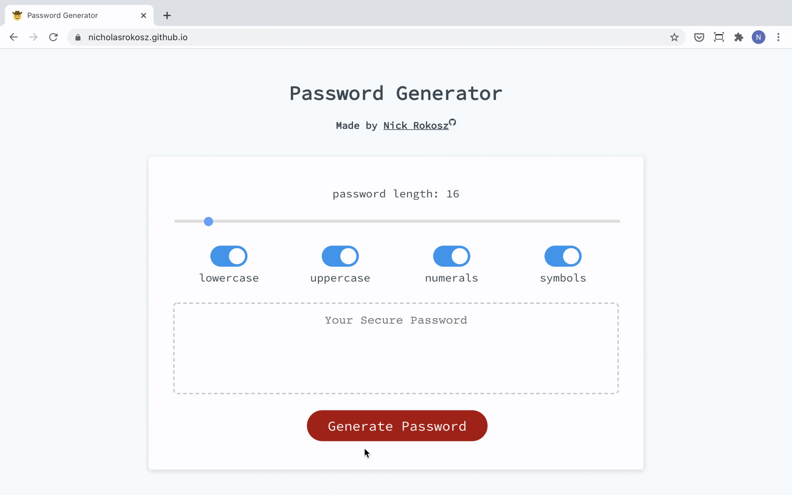

# password-generator

This is a simple web app that generates a pseudo-random password. The user provides the password length and selects which types of characters are to be included in the `generatePassword()` function.

This was a very fulfilling project for me as it was my first taste of the power of JavaScript in conjunction with HTML and CSS. This project also served as an experiment in UI/UX design. I like the idea of building intuitive, minimalistic web apps that don't require instructions to use. I very much look forward to exploring this discipline more.

Please check out the deployed site [here](https://nicholasrokosz.github.io/password-generator/).

## Password Length
Use the slider at the top of the app to choose your desired password length.
Any length between 8 and 128 is valid.

## Included Character Types
Use the switches to toggle between included and excluded (default for all is included).
At least one character type must be included in order to generate a password.

